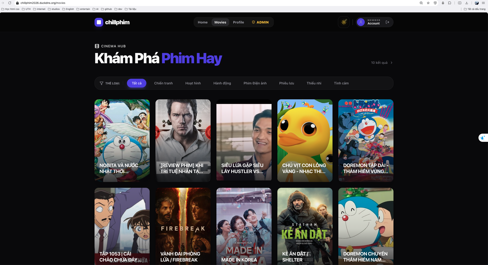
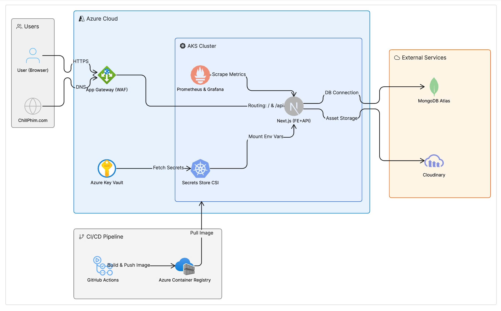
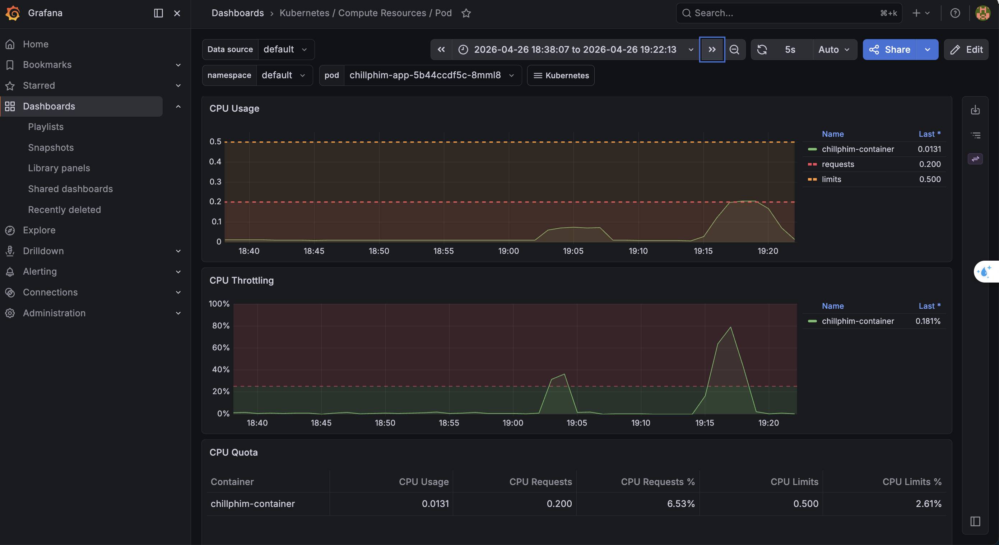
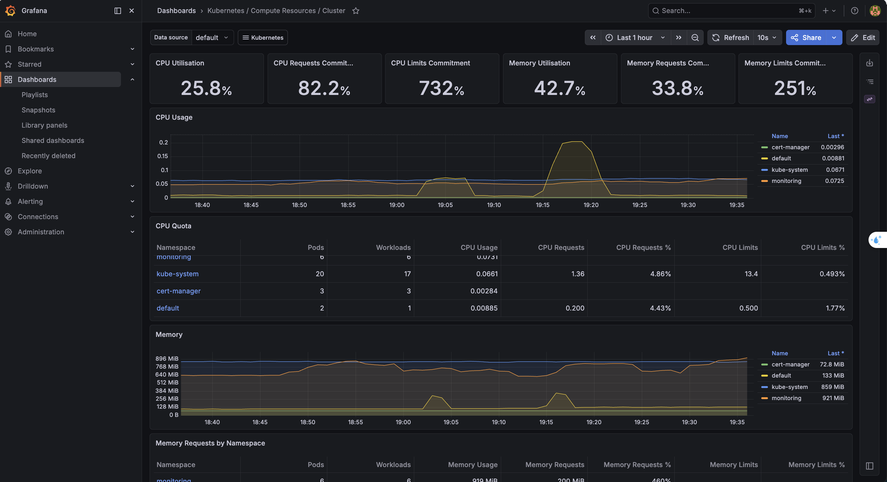

# 🎬 ChillPhim – Movie Streaming System (Cloud Native Edition)

**ChillPhim** là hệ thống quản lý phim trực tuyến được thiết kế theo tư duy Cloud-Native, tích hợp chặt chẽ quy trình DevOps hiện đại từ triển khai hạ tầng đến giám sát hiệu năng thực tế.

**🌐 Live Demo:** [https://chillphim2026.duckdns.org](https://chillphim2026.duckdns.org)

---

## 🏗️ Architecture & Cloud Infrastructure

Hệ thống được vận hành trên Azure với sự hỗ trợ của mô hình **Infrastructure as Code (IaC)**.

✨ **Key Features:**

- **☁️ Zero-Touch Infrastructure:** Toàn bộ tài nguyên (Resource Group, AKS, ACR) được khởi tạo tự động qua **Terraform**, loại bỏ cấu hình thủ công.
- **🛡️ Hardened Security:** Sử dụng **Azure Application Gateway (WAF)** bảo vệ lớp biên và **Azure Key Vault** kết hợp **Secrets Store CSI Driver** để quản lý thông tin nhạy cảm.
- **🚢 Unified Orchestration:** Vận hành trên **Azure Kubernetes Service (AKS)**, đảm bảo tính sẵn sàng cao và khả năng tự hồi phục (Self-Healing).
- **🤖 Automated CI/CD:** Pipeline **GitHub Actions** tự động đóng gói Docker Image, đẩy vào ACR và cập nhật tức thì lên Cluster.
- **🕸️ Edge Security:** Tích hợp **Cert-manager** tự động cấp phát và quản lý chứng chỉ SSL/TLS từ Let's Encrypt.
- **📊 K8s-Native Monitoring:** Triển khai Full Stack **Prometheus & Grafana** để quan sát sức khỏe Cluster theo thời gian thực.

---

## 📈 Performance & Monitoring

Khả năng chịu tải được chứng minh qua các bài Stress Test thực tế trên hạ tầng giới hạn (Azure Student B2s).

✨ **Observability Insights:**

- **⚡ High-Throughput:** Xử lý thành công **1,132 requests** với tỉ lệ **99.87% OK** trong bài Stress Test 100 Virtual Users đồng thời (k6).
- **📉 Smart Resource Quota:** Thiết lập nghiêm ngặt `Requests` và `Limits` cho Pod, ngăn chặn hiện tượng lấn chiếm tài nguyên hệ thống.
- **🚀 Efficient Recovery:** Hệ thống tự động giải phóng tài nguyên CPU/RAM và duy trì trạng thái ổn định ngay sau khi kết thúc đợt tải đỉnh điểm.

_Giám sát tổng thể tài nguyên Cluster tại thời điểm Stress Test._

_Chi tiết hiệu năng Pod ứng dụng khi xử lý tải 100 user đồng thời._

---

## 👨‍💻 Author

**Nguyễn Thành Phát**
_Dự án tập trung vào: Fullstack Development | Cloud Engineering | DevOps Practices._
